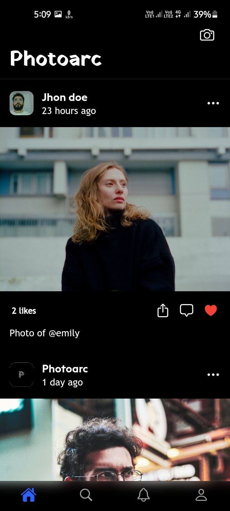
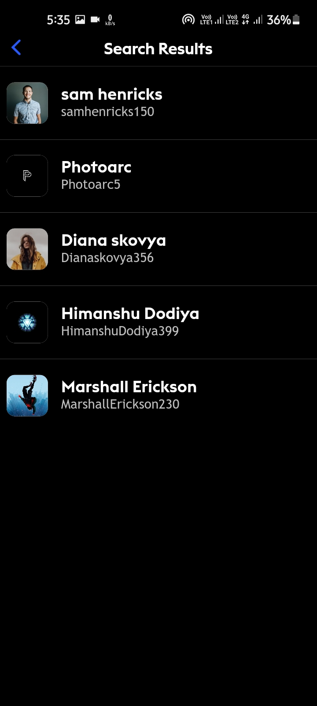
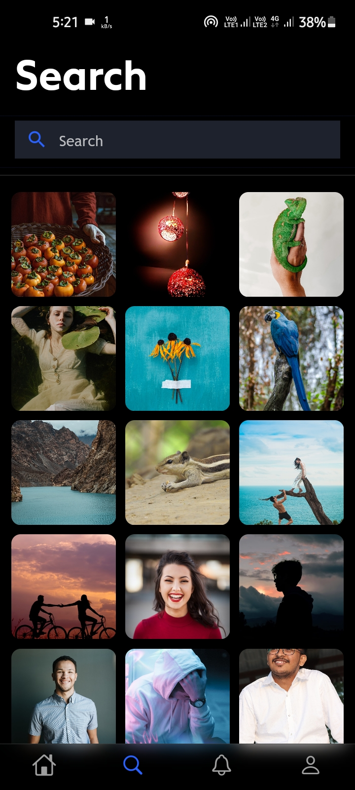
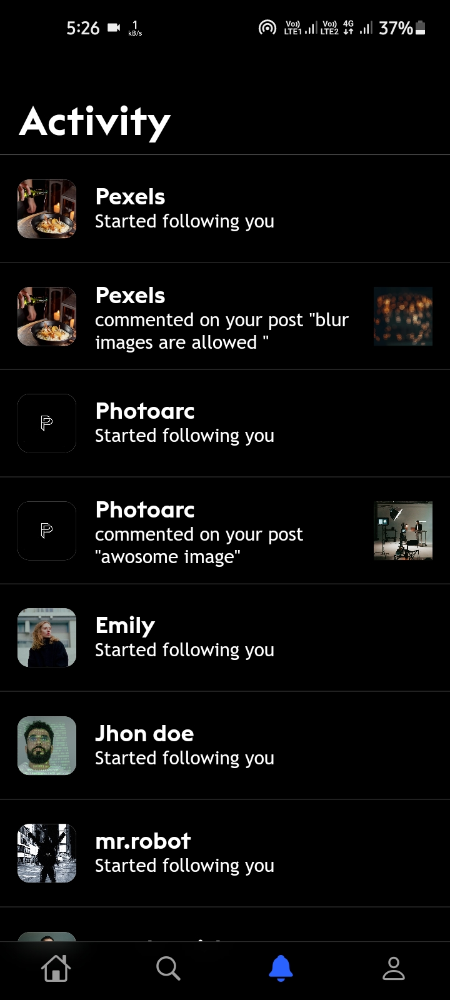
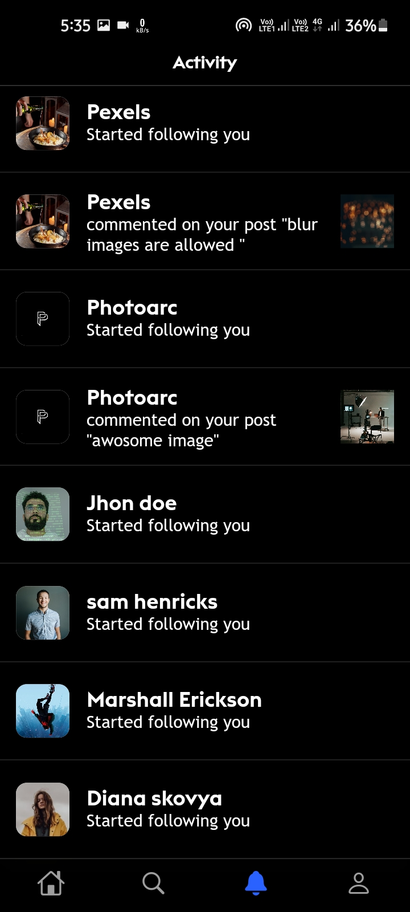
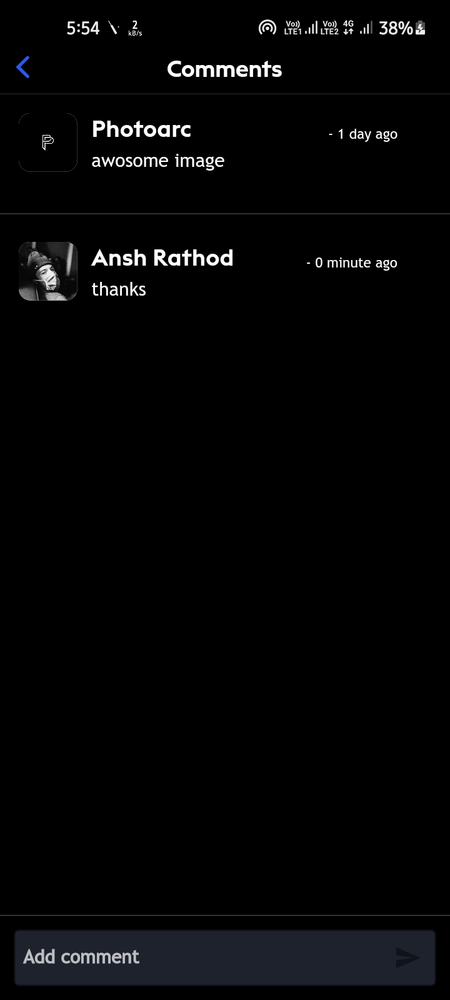
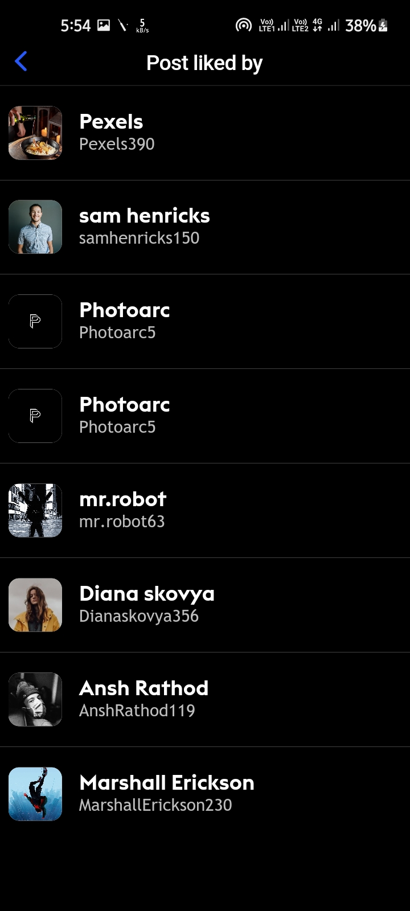
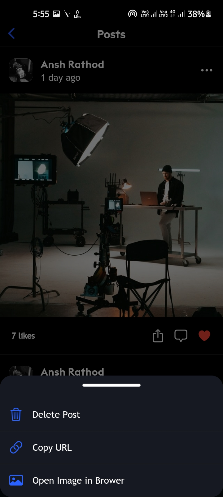
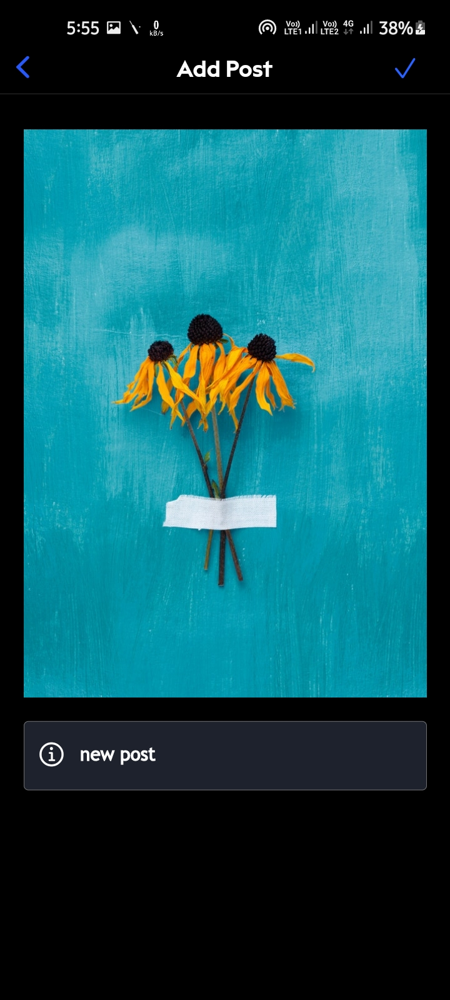
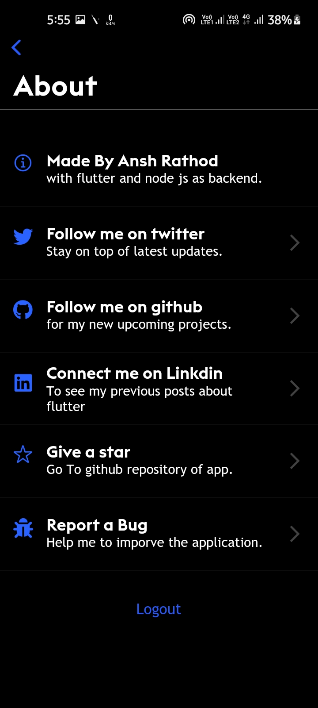

# **Photoarc**

A Fully functional social media app written in flutter and dart using node.js and Postgres SQL as backend.

## **Demo**

<center>


<h3 style="color:green;">Download the release APK</h3>
</center>

## **Features**

- custom photo feed based on following users'.
- Users can post an image of any height.
- awesome animation between navigation of two pages.
- shimmer loading effect while data is syncing.
- Search page
  - With trending posts grid view.
- Profile page
  - follows/unfollow the user
  - edit profile.
  - change user's avatar image
  - generate user profile links and send that to the various platforms. (with firebase dynamic links)
- Notification Page
  - shows all comments and follows user notifications.
  - delete the notification by right swipe.
- Post
  - like the post.
  - comment on posts and see all comments.
  - delete comments. (only post owner and commenter can)
  - shows the list of who liked the post.
  - share post links to the various platforms.
  - copy URL.
  - open post image in the browser.
  - user can delete their own post.
- create post.
  - crop image
  - upload from the gallery.
  - Users can add captions to post.

<br/>

## **Image Gallery**

<hr/>

### **feed screen**

<br>

<center>



</center>
<hr/>

### **Search page**

<br>

<center>



</center>
<hr/>

### **Activity page**

<br>

<center>



</center>
<hr/>

### **Profile page**

<br>

<center>


</center>
<hr/>

### **Other pages**

<br>

<center>






</center>
<hr/>

## **Dependencies**

- [cupertino_icons](https://pub.dev/packages/cupertino_icons)
- [firebase_auth](https://pub.dev/packages/firebase_auth)
- [firebase_core](https://pub.dev/packages/firebase_core)
- [http](https://pub.dev/packages/http)
- [flutter_bloc](https://pub.dev/packages/flutter_bloc)
- [equatable](https://pub.dev/packages/equatable)
- [shared_preferences](https://pub.dev/packages/shared_preferences)
- [logger](https://pub.dev/packages/logger)
- [image_cropper](https://pub.dev/packages/image_cropper)
- [image_picker](https://pub.dev/packages/image_picker)
- [uuid](https://pub.dev/packages/uuid)
- [scrollable_positioned_list](https://pub.dev/packages/scrollable_positioned_list)
- [cached_network_image](https://pub.dev/packages/cached_network_image)
- [firebase_dynamic_links](https://pub.dev/packages/firebase_dynamic_links)
- [shimmer](https://pub.dev/packages/shimmer)
- [share](https://pub.dev/packages/share)
- [url_launcher](https://pub.dev/packages/url_launcher)
- [flutter_phoenix](https://pub.dev/packages/flutter_phoenix)
- [font_awesome_flutter](https://pub.dev/packages/font_awesome_flutter)

## **How to run?**

To clone and run this application, you'll need [Git](https://git-scm.com/downloads) and [Flutter](https://flutter.dev/docs/get-started/install) installed on your computer. From your command line:

### Clone this repository

```bash
$ git clone https://github.com/Appii00/Flutter-Bloc-MovieDB-App.git
```

### Go into the repository

```bash
$ cd Flutter-Bloc-MovieDB-App
```

### Install dependencies

```bash
$ flutter packages get
```

### Run the app

```bash
$ flutter run
```

## **What's Next?**

This features will be added in next version of the app.

- add muliple images in post.
- add reply to and like to comments.
- add notifications from api.
- add activity notifications sorting stay new on top.
- add status feature.
